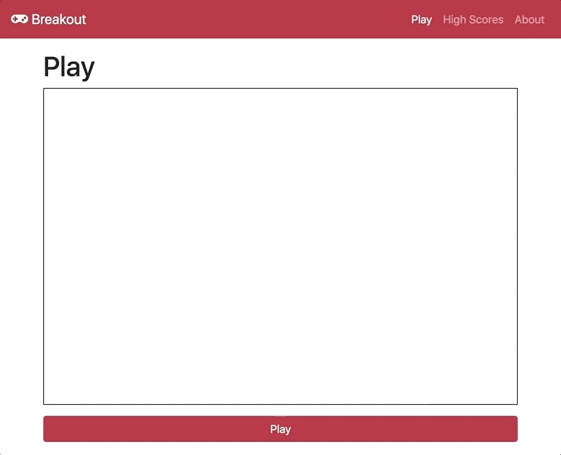

# Sample Game: Breakout

## Goal

This repository is here to show a sample game made at Ironhack on week 3 with Canvas (and some jQuery) and give guidance to reproduce it.



## Iterations to reproduce

### Iteration 1 | Create the files

Create the following files:
- `index.html`
- `style.css`
- `js/`
  - `Ball.js`
  - `Brick.js`
  - `Game.js`
  - `Paddle.js`
  - `levels.js`
  - `function.js`
  - `main.js`

Then, link all the files in `index.html`, with `main.js` in the end since it reuse everything before.
```html
<script src="js/Ball.js"></script>
<script src="js/Brick.js"></script>
<script src="js/Game.js"></script>
<script src="js/Paddle.js"></script>
<script src="js/levels.js"></script>
<script src="js/functions.js"></script>
<script src="js/main.js"></script>
```

### Iteration 2 | Create a Game class and render it

- In `Game.js`, create a `Game` class with the following methods:
  - `constructor(ctx,grid)` you should initialize with `this.lives = 3` 
  - `draw()`: Only display the number of lives on the top right corner
  - `start()`: should call `draw` every `1000/60` seconds
- In `main.js`, create a variable `game` that is a `Game` and call `game.start()`

### Iteration 3 | Display bricks

- Create a file `levels.js` like below
- In `Brick.js`, create a `Brick` class with the following methods:
  - `constructor(ctx,x,y,width,height)`
  - `draw()`
- In `main.js`, do `game = new Game(ctx, levels[0].grid)`
- In `Game.js`:
  - `constructor(ctx,grid)`: Add a `this.bricks` property set with the values from `grid`
  - `draw()`: Add some code to draw all elements from `this.bricks`
 

```js
// levels.js
var levels = [{
  name: 'Level 1',
  grid: [
    ['X',' ','X','X','X',' ','X',' ','X',' ','X'],
    ['X',' ',' ','X',' ',' ','X',' ','X',' ','X'],
    ['X',' ',' ','X',' ',' ','X','X','X',' ','X'],
    ['X',' ',' ','X',' ',' ','X',' ','X',' ','X'],
    ['X',' ','X','X','X',' ','X',' ','X',' ','X']
  ]
}]
```